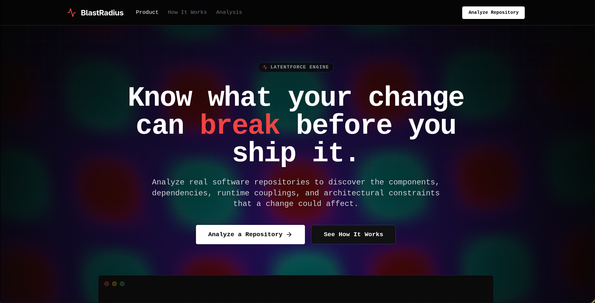
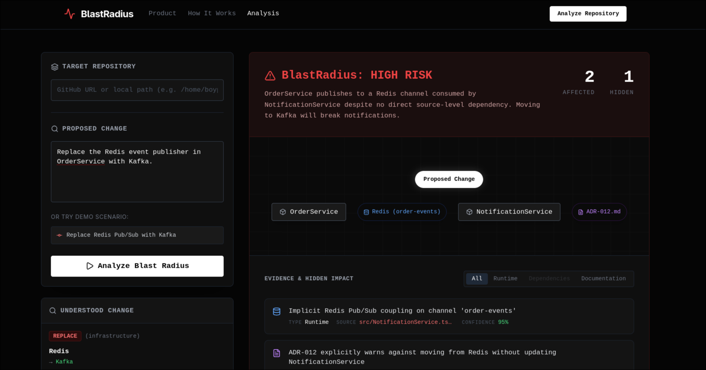

# BlastRadius

[Live Demo](https://blastradius-tau.vercel.app/)



An advanced engineering diagnostic tool built during the **LatentForce.ai BuildSprint**.

BlastRadius helps engineers answer one critical question before they ship:
> **"If I make this change, what could I actually break?"**

---

##  The Problem
Standard static analysis tools and IDEs trace explicit source-level dependencies (like `import` statements). But in modern microservices and event-driven architectures, the most dangerous breakages occur at boundaries that static analysis misses:

- **Implicit runtime couplings** (e.g., Redis Pub/Sub channels, React context dispatches, shared message queues).
- **Cross-service dependencies** disguised as opaque string contracts.
- **Architectural invariants** documented in ADRs but not enforced in code.
- **Historical engineering decisions**.

##  The Solution
BlastRadius operates an advanced Natural Language Change Parser coupled with a semantic analysis engine to perform structural investigations of any GitHub repository.



When a change is proposed (e.g., *"Replace Redis event publisher with Kafka"*), BlastRadius:
1. Translates the natural language intent into a structured `ChangeSpecification`.
2. Clones the target repository and performs context-aware filesystem traversals.
3. Discovers implicit dependencies and explicit code linkages.
4. Cross-references documentation and Architecture Decision Records (ADRs).
5. Emits a visual graph, an evidence-backed **Risk Assessment**, and a precise **Verification Plan**.

---

##  Usage & Installation

BlastRadius can analyze real public GitHub repositories without requiring GitHub credentials, making it trivial to run locally.

```bash
# Clone the project
git clone https://github.com/ScottHallchico/BlastRadius.git
cd BlastRadius

# Install dependencies
npm install

# Start the dev server
npm run dev
```

Visit `http://localhost:3000` to interact with the BlastRadius dashboard.

### Example Scenarios to Try
Point the **Target Repository** to any real GitHub URL (e.g. `https://github.com/expressjs/express`) or try these on the built-in `demo-repo`:

- **Replace the Redis event publisher in OrderService with Kafka.**
  *(Triggers High Risk: Discovers implicit pub/sub coupling and ADR invariants)*
- **Modify the Button component's onClick handler to accept an async function.**
  *(Context-aware: Traces explicit consumers of the specific `onClick` property)*
- **Rename Router to RequestRouter.**
  *(Calculates elevated migration risk across the application)*

---

##  Architecture

BlastRadius is built as a deployment-ready Next.js application, completely decoupled from `child_process` Git requirements for Vercel compatibility.

1. **Frontend**: Next.js 14 App Router, Tailwind CSS, `cmdk` command palette, and interactive `xyflow/react` dependency visualizations.
2. **Change Specification Layer**: Parses natural text using hybrid regex/semantic mapping to derive Target, Operation (REPLACE/MODIFY/REMOVE/RENAME), and Execution Boundaries.
3. **Acquisition Engine**: Native Node.js `https` and `tar` pipeline streams to download and extract GitHub repositories onto the edge serverlessly.
4. **Analysis Engine**: A robust event-loop friendly `fs` walker that extracts runtime contexts (`useContext`, `dispatch`, `publish`) mapping semantic boundaries.
